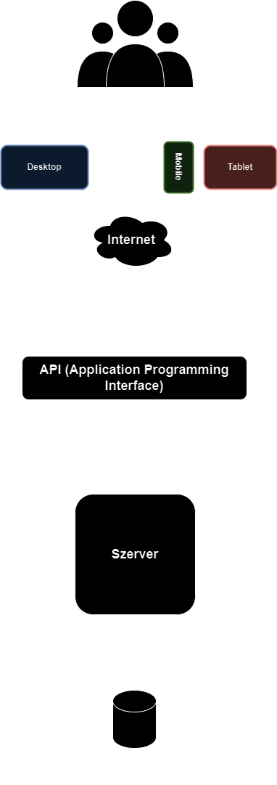
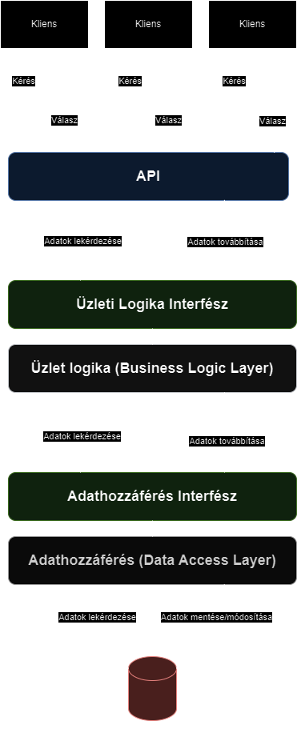

# Adatbázis Terv
## 1. Áttekintés
A blog webalkalmazás lehetővé teszi a felhasználók számára blogbejegyzések létrehozását, olvasását, frissítését és törlését, valamint kommentek hozzáadását az egyes bejegyzésekhez.
## 2. Adatbázis típus
A projekthez relációs adatbázist (pl. MySQL, PostgreSQL) használunk, mivel ez jól alkalmazható strukturált adatok kezelésére, meghatározott kapcsolatokkal. Alternatívaként egy NoSQL adatbázis (pl. MongoDB) is fontolóra vehető, ha az alkalmazásnak skálázódnia kell
## 3. Entitások és Táblák

### 3.1 Users

A `Users` tábla az összes regisztrált felhasználót fogja tárolni, beleértve a profiljukhoz tartozó adatokat.

#### Mezők:
- `user_id` (Elsődleges kulcs)
- `username` (Egyedi)
- `email` (Egyedi)
- `password_hash`
- `bio`
- `profile_picture_url`
- `created_at` (Dátum)

#### Kapcsolatok:
- Egy felhasználó több blogbejegyzést hozhat létre.
- Egy felhasználó több bejegyzést is kedvelhet.
- Egy felhasználó több bejegyzéshez is hozzászólhat.
- Egy felhasználó követhet más felhasználókat (önhivatkozó kapcsolat).

### 3.2 BlogPosts

A `BlogPosts` tábla a felhasználók által létrehozott blogbejegyzések részleteit tárolja.

#### Mezők:
- `post_id` (Elsődleges kulcs)
- `user_id` (Külső kulcs hivatkozva a `Users` táblára)
- `title`
- `content`
- `image_url`
- `created_at` (Dátum)
- `updated_at` (Dátum)

#### Kapcsolatok:
- Egy bejegyzéshez több komment is tartozhat.
- Egy bejegyzést több felhasználó is kedvelhet.

### 3.3 Comments

A `Comments` tábla a blogbejegyzésekhez fűzött felhasználói kommenteket tárolja.

#### Mezők:
- `comment_id` (Elsődleges kulcs)
- `post_id` (Külső kulcs hivatkozva a `BlogPosts` táblára)
- `user_id` (Külső kulcs hivatkozva a `Users` táblára)
- `content`
- `created_at` (Dátum)

#### Kapcsolatok:
- Egy komment egy blogbejegyzéshez kapcsolódik.
- Egy komment egy felhasználóhoz kapcsolódik.

## 4. Kapcsolatok a Táblák Között

A táblák közötti kapcsolatok külső kulcsokkal lesznek meghatározva:

- **1-to-many** kapcsolat a `Users` és a `BlogPosts`, `Comments` táblák között.

# Funkcionális Terv

## 1. Felhasználókezelés

### 1.1. Regisztráció

- A felhasználók megadhatják a szükséges adatokat (felhasználónév, email, jelszó) egy regisztrációs űrlapon.
- A jelszavakat titkosítva tároljuk bcrypt algoritmussal.
- Az email egyedi azonosítóként szolgál.
- Az űrlap validációkat tartalmaz, mint például az email formátumának ellenőrzése, valamint az erős jelszó követelménye (min. 8 karakter, szám és speciális karakter).
### 1.2. Bejelentkezés

- A felhasználók bejelentkezhetnek felhasználónév vagy email és jelszó kombinációjával.
- Hiba esetén visszajelzést kapnak a helytelen bejelentkezési adatokról.
- Sikeres bejelentkezés után egy hitelesítő JSON Web Token-t (JWT) kapnak.
### 1.3. Jelszó visszaállítás

- A felhasználók elfelejtett jelszó esetén kérhetnek email alapú jelszó visszaállítást.
- Felhasználói profil szerkesztése

- A felhasználók módosíthatják a profiljukat (név, profilkép, bio).
- A profilkép URL-t tároljuk, amely egy külső fájlkezelő rendszerből származhat.
### 1.4. Követési rendszer

- A felhasználók követhetnek más felhasználókat.
- Követés/törlés gomb áll rendelkezésre más felhasználók profiloldalán.
## 2. Blogbejegyzések kezelése

### 2.1. Új blogbejegyzés létrehozása

- A felhasználók létrehozhatnak új bejegyzést egy űrlap kitöltésével, ahol megadhatják a bejegyzés címét, tartalmát, és feltölthetnek képet (image URL formájában).
- A bejegyzés az adatbázisba mentésre kerül a felhasználó azonosítójával.
### 2.2. Blogbejegyzések listázása

- A felhasználók megtekinthetik saját és mások blogbejegyzéseit.
- A blogbejegyzéseket időrend szerint rendezzük, és minden bejegyzés rövid leírással, kép előnézettel jelenik meg.
### 2.3. Blogbejegyzés szerkesztése

- A bejegyzés tulajdonosa módosíthatja a blogbejegyzés tartalmát, címét és a feltöltött képet.
- A bejegyzés mentésekor frissítjük a updated_at mezőt.
### 2.4. Blogbejegyzés törlése

- A felhasználók törölhetik saját bejegyzéseiket.
- Törlés esetén a kapcsolódó kommentek is törlésre kerülnek (logikai törlés).
### 2.5. Blogbejegyzések kedvelése

- A felhasználók kedvelhetik más felhasználók bejegyzéseit.
- Egy felhasználó csak egyszer kedvelhet egy bejegyzést.
## 3. Kommentkezelés

### 3.1. Új komment létrehozása

- A felhasználók kommenteket fűzhetnek a blogbejegyzésekhez.
- A kommentek megjelennek a hozzászólások részben, és időrendben vannak rendezve.
### 3.2. Komment szerkesztése

- A felhasználók módosíthatják saját hozzászólásaikat.
### 3.3. Komment törlése

- A felhasználók törölhetik saját kommentjeiket.
- Törlés esetén a komment logikailag törlődik az adatbázisból.
## 4. Adminisztrációs funkciók

### 4.1. Felhasználók kezelése

- Az adminisztrátorok felfüggeszthetik, módosíthatják vagy törölhetik a felhasználói fiókokat.
### 4.2. Tartalom moderálása

- Az adminisztrátorok módosíthatják vagy törölhetik a felhasználók által létrehozott blogbejegyzéseket és kommenteket, ha azok nem felelnek meg az oldal irányelveinek.
## 5. Értesítések

### 5.1. Új követő értesítése

- A felhasználók értesítést kapnak, ha valaki elkezdte követni őket.
### 5.2. Új komment értesítése

- Értesítést kapnak, ha valaki kommentet fűzött a blogbejegyzésükhöz.
### 5.3. Új kedvelés értesítése

- A felhasználók értesítést kapnak, ha valaki kedvelte a blogbejegyzésüket.
## 6. Biztonsági funkciók

### 6.1. Autentikáció és jogosultságkezelés

- A felhasználók jelszavait bcrypt-tel titkosítjuk.
- Az adminisztrátorok számára kétfaktoros hitelesítés áll rendelkezésre.
### 6.2. HTTPS támogatás

- Az összes adatforgalom titkosítva zajlik HTTPS protokollon keresztül, védve a felhasználói adatokat.
### 6.3. Adatmentés

- Heti adatmentés történik az adatbázisról, melyek visszaállíthatók hiba vagy adatvesztés esetén.

# Tesztterv

## 1. Áttekintés
Ez a tesztterv részletezi a blog webalkalmazás adatbázisának, felhasználói funkcióinak, blogkezelésének és biztonsági elemeinek tesztelésére vonatkozó lépéseket. A cél annak biztosítása, hogy a rendszer megfelelően működjön, és megfeleljen az üzleti követelményeknek.

## 2. Tesztelési célok
- Annak ellenőrzése, hogy az adatbázis-struktúra helyesen működik.
- Az egyes funkciók helyes működésének megerősítése (CRUD műveletek, felhasználókezelés, kommentkezelés).
- A rendszer biztonsági funkcióinak (autentikáció, jogosultságkezelés) validálása.
- A felhasználói értesítések és adminisztrációs funkciók megfelelő működésének ellenőrzése.

## 3. Tesztelési területek

## 3.1 Felhasználókezelés
### 3.1.1 Regisztráció
- **Bemenet**: Regisztráció űrlap kitöltése helyes adatokkal (felhasználónév, email, jelszó).
- **Elvárt eredmény**: A felhasználói fiók sikeresen létrejön, és a felhasználó adatbázisban tárolódik.
- **Hibaesetek**: Hiányos vagy érvénytelen adatok esetén hibaüzenet jelenik meg (pl. üres mezők, duplikált email).

### 3.1.2 Bejelentkezés
- **Bemenet**: Helyes felhasználónév/email és jelszó megadása.
- **Elvárt eredmény**: A felhasználó sikeresen bejelentkezik, és egy JWT-t kap.
- **Hibaesetek**: Helytelen adatok megadása esetén hibaüzenet jelenik meg.

### 3.1.3 Jelszó visszaállítás
- **Bemenet**: A jelszó visszaállítási folyamat elindítása regisztrált email-címmel.
- **Elvárt eredmény**: A felhasználó emailt kap a jelszó visszaállítási linkkel.
- **Hibaesetek**: Helytelen email-cím esetén hibaüzenet jelenik meg.

## 3.2 Blogbejegyzések kezelése
### 3.2.1 Blogbejegyzés létrehozása
- **Bemenet**: Új blogbejegyzés létrehozása cím és tartalom megadásával.
- **Elvárt eredmény**: A bejegyzés sikeresen mentésre kerül az adatbázisba.
- **Hibaesetek**: Hiányzó adatok esetén a rendszer hibaüzenetet ad.

### 3.2.2 Blogbejegyzés szerkesztése
- **Bemenet**: Egy meglévő blogbejegyzés módosítása.
- **Elvárt eredmény**: A módosított adatok mentésre kerülnek, és az updated_at mező frissül.
- **Hibaesetek**: Nem engedélyezett felhasználó módosítási kísérlet esetén hibaüzenet jelenik meg.

### 3.2.3 Blogbejegyzés törlése
- **Bemenet**: A felhasználó törli saját blogbejegyzését.
- **Elvárt eredmény**: A bejegyzés logikailag törlődik az adatbázisból.
- **Hibaesetek**: Nem jogosult felhasználó esetén hibaüzenet jelenik meg.

## 3.3 Kommentkezelés
### 3.3.1 Új komment létrehozása
- **Bemenet**: Komment hozzáadása egy blogbejegyzéshez.
- **Elvárt eredmény**: A komment sikeresen mentésre kerül, és megjelenik a hozzászólások között.
- **Hibaesetek**: Hiányzó tartalom vagy nem bejelentkezett felhasználó esetén hibaüzenet.

### 3.3.2 Komment szerkesztése
- **Bemenet**: Saját komment módosítása.
- **Elvárt eredmény**: A komment frissítése az adatbázisban megtörténik.
- **Hibaesetek**: Nem jogosult felhasználó szerkesztési kísérletekor hibaüzenet jelenik meg.

## 3.4 Biztonsági tesztek
### 3.4.1 Autentikáció
- **Bemenet**: Helyes és helytelen bejelentkezési adatok megadása.
- **Elvárt eredmény**: Helyes adatokkal sikeres bejelentkezés, helytelen adatokkal hibaüzenet.
- **Hibaesetek**: Nem megfelelő authentikációs mechanizmus esetén (pl. jelszó kiszivárgása).

### 3.4.2 HTTPS kapcsolatok
- **Bemenet**: HTTPS protokoll használata a webalkalmazáshoz való csatlakozáskor.
- **Elvárt eredmény**: Minden adatforgalom titkosítva zajlik.
- **Hibaesetek**: Nem titkosított (HTTP) kapcsolódási kísérlet esetén figyelmeztetés.

### 3.4.3 Jogosultságkezelés
- **Bemenet**: Adminisztrátori és normál felhasználói műveletek végrehajtása.
- **Elvárt eredmény**: Csak az adminisztrátorok férnek hozzá bizonyos funkciókhoz.
- **Hibaesetek**: Jogosultsági hibák esetén hibaüzenet.

## 3.5 Értesítések
### 3.5.1 Új követő értesítése
- **Bemenet**: Egy felhasználó követi a másikat.
- **Elvárt eredmény**: Az érintett felhasználó értesítést kap az új követőről.
- **Hibaesetek**: Hiányzó vagy késleltetett értesítések.

## 3.6 Adminisztrációs funkciók
### 3.6.1 Felhasználók kezelése
- **Bemenet**: Az adminisztrátor módosítja vagy törli egy felhasználó fiókját.
- **Elvárt eredmény**: A művelet sikeres végrehajtása az adatbázisban.
- **Hibaesetek**: Helytelen adminisztrátori jogosultságok esetén a művelet sikertelen.

## 4. Tesztelési módszertan
- **Manuális tesztelés**: A felhasználói felület funkcióinak ellenőrzéséhez.
- **Automatizált tesztelés**: Unit tesztek futtatása backend funkciókhoz.
- **Biztonsági tesztelés**: Behatolás-észlelési és autentikációs tesztek futtatása.

# Fizikai Környezet

## 1. Biztonsági Funkciók

### 1.1. Autentikáció és jogosultságkezelés
- A felhasználók jelszavait **bcrypt** algoritmussal titkosítjuk az adatbázisban. Az algoritmus biztonságos, mivel sót (salt) használ, amely megnehezíti a brute-force támadásokat. Az algoritmus több körös hash-elést alkalmaz.
- A felhasználóknak erős jelszót kell megadniuk (legalább 8 karakter hosszú, tartalmaz számokat és speciális karaktereket), ami minimalizálja a gyenge jelszavak miatti támadási lehetőségeket.
- Az adminisztrátorok számára elérhető a kétfaktoros hitelesítés (2FA), amely megerősíti az autentikációt egy másodlagos hitelesítési lépés (pl. mobilalkalmazás vagy SMS-kód) használatával.

### 1.2. HTTPS használata
- A rendszer minden adatátvitelét **HTTPS** protokollon keresztül bonyolítja, amely garantálja, hogy az adatok titkosítva kerülnek továbbításra. Ez megakadályozza, hogy a felhasználói adatokat harmadik felek hozzáférjék, védi a **man-in-the-middle** támadások ellen.
- Az SSL/TLS tanúsítvány telepítése és frissítése folyamatosan biztosítja a biztonságos adatkapcsolatot.

### 1.3. Hozzáférési szintek
- A rendszer különböző jogosultsági szinteket biztosít a felhasználók számára. Az adminisztrátori jogosultságokkal rendelkező felhasználók hozzáférhetnek speciális funkciókhoz, mint például a felhasználók kezeléséhez és a tartalmak moderálásához.
- A normál felhasználók csak a saját tartalmukhoz és adataikhoz férnek hozzá, ezáltal biztosítva, hogy ne módosíthassák mások tartalmait.

### 1.4. Adatmentés és visszaállítás
- A rendszer **heti** rendszerességgel biztonsági mentést készít az adatbázisról. Ezek a mentések titkosított formában kerülnek tárolásra, biztosítva a jogosulatlan hozzáférés elleni védelmet.
- A mentések automatikusan készülnek, és egy külön szerveren kerülnek tárolásra, amely fizikailag és logikailag is elkülönül a fő rendszertől. Ez biztosítja, hogy kritikus hiba vagy adatvesztés esetén a rendszer visszaállítható legyen.

### 1.5. Adathozzáférés korlátozása
- Az adatbázis hozzáférése szigorúan korlátozott. Csak az adminisztrátorok férhetnek hozzá közvetlenül az adatbázishoz, és minden hozzáférési kísérletet naplózunk.
- A hozzáférési szabályzat biztosítja, hogy minden felhasználói adatot csak az arra jogosult személyek módosíthatnak.

### 1.6. Behatolás-észlelés
- A rendszer rendelkezik beépített **behatolás-észlelő rendszerrel (IDS)**, amely folyamatosan figyeli a bejövő forgalmat és figyelmeztet a gyanús tevékenységekre.
- A naplózott eseményeket folyamatosan elemzi a rendszer, és minden esetleges támadási kísérlet esetén automatikus értesítést küld az adminisztrátoroknak.

## 2. Rendszer bővíthetősége

### 2.1. Moduláris felépítés
- A rendszer tervezése során elsődleges szempont a moduláris felépítés biztosítása. Minden funkcionális egység külön modulban kap helyet, ezáltal új funkciók egyszerűen hozzáadhatók a meglévő struktúrához anélkül, hogy a rendszer többi része sérülne.
- A modulok közötti kommunikáció jól definiált API-kon keresztül történik, így a jövőbeni bővítések esetén csak az új modulokra vonatkozó interfészeket kell megváltoztatni, a meglévők érintetlenek maradhatnak.

### 2.2. Skálázhatóság
- A rendszer horizontálisan és vertikálisan is skálázható. A rendszer képes új szerverek hozzáadására terheléselosztóval, így a forgalom növekedésével további erőforrásokat tudunk biztosítani a megfelelő működéshez.
- Az adatbázisok replikációja és sharding technikák lehetővé teszik a nagy mennyiségű adat kezelését, valamint az olvasási és írási műveletek szétválasztását, ami növeli a teljesítményt és csökkenti a késleltetést.

### 2.3. Plugin rendszer
- A rendszerhez plugin-alapú bővítési lehetőséget biztosítunk, amely lehetővé teszi külső fejlesztők számára is a funkciók egyszerű hozzáadását. A pluginok előre definiált szabványokat követnek, ezáltal könnyen integrálhatók és frissíthetők.

### 2.4. Microservices architektúra
- A rendszer egy microservices architektúrán alapul, amely lehetővé teszi, hogy az egyes szolgáltatások különálló komponensként működjenek. Így a fejlesztők könnyedén hozzáadhatnak új szolgáltatásokat anélkül, hogy a meglévő szolgáltatások működését befolyásolnák.
- Az egyes szolgáltatások külön-külön skálázhatók és frissíthetők, ami biztosítja a rendszer rugalmasságát és könnyű bővíthetőségét.

## 3. Fejlesztői eszközök

### 3.1. Verziókezelés - Git
- A projekt verziókövetését a Git rendszerrel végezzük. A forráskód tárolása és kezelése egy GitHub repository-ban történik, amely támogatja a kollaboratív fejlesztést és a visszagörgetési lehetőségeket.
- Branching modell: a fejlesztők külön brancheken dolgoznak, majd a véglegesítést pull requestekkel oldják meg. A `main` ág stabil, release-re kész kódot tartalmaz.

### 3.2. Fejlesztési környezet - IDE és kódszerkesztők
- Javasolt IDE: **Visual Studio Code**, amely gazdag bővítmény támogatással rendelkezik, mint például a Git integráció, valamint a nyelvi szerkesztő bővítmények (HTML, CSS, JavaScript).
- Egyéb javasolt fejlesztői eszközök: **IntelliJ IDEA**, **WebStorm** a JavaScript és webes fejlesztésekhez, valamint **PyCharm** a Python fejlesztéshez.

### 3.3. Konténerizálás - Docker
- A fejlesztési környezet egységesítéséhez és a deploy folyamatok egyszerűsítéséhez a Docker konténerizálási megoldást alkalmazzuk. Minden fejlesztői környezet azonos Docker image-t használ, így biztosítva a konzisztens futtatási környezetet.
- A Docker Compose segítségével több szolgáltatás (pl. web szerver, adatbázis) egyszerre futtatható, szinkronban a helyi fejlesztői környezettel.

### 3.4. CI/CD pipeline - GitHub Actions
- A folyamatos integráció és folyamatos szállítás (CI/CD) folyamatokat a **GitHub Actions** platform biztosítja. Minden commit és pull request automatikusan építési és tesztelési folyamatokon megy keresztül, amely biztosítja, hogy a kód mindig stabil állapotban maradjon.
- Az automatikus tesztelés és kódminőség-ellenőrzés (pl. linting, statikus kódelemzés) be van állítva a build pipeline-ba.

### 3.5. Tesztelési keretrendszer
- Az egységtesztek futtatásához a **Jest** keretrendszert használjuk (JavaScript), míg backend oldalon **Pytest** (Python) kerül alkalmazásra.
- Minden új funkcióhoz kötelező a megfelelő teszt lefedettség, amely biztosítja a kód helyes működését és a regressziók elkerülését.

### 3.6. Hibajegy- és feladatkezelő eszköz - Jira
- A feladatok követését és priorizálását a **Jira** rendszer végzi. Itt minden feladat jól nyomon követhető, a felhasználói sztorik, hibajegyek és fejlesztési backlogok rendszerezésre kerülnek.
- A sprinttervezéshez és a hatékonyság követéséhez Scrum-alapú táblák állnak rendelkezésre.

### 3.7. Kódminőség-ellenőrzés - ESLint és Prettier
- A JavaScript és TypeScript kódok formázását és ellenőrzését az **ESLint** és **Prettier** eszközökkel végezzük. Ez biztosítja az egységes kódstílust és a lehetséges hibák gyors felismerését a fejlesztés korai szakaszában.
- Ezek a fejlesztői eszközök automatikusan futnak minden commit során, így biztosítva a kód tisztaságát.

### 3.8. Verziókezelési szabályok
- Minden commit üzenet és branch név követi az egységes nevezéktant. A commit üzeneteknek egyértelműnek és informatívnak kell lenniük, míg a branchek neveinek utalniuk kell a kapcsolódó feladatra (pl. `feat/login-page`).
- Minden kódrészlet átmegy code review-n, amit egy másik fejlesztő validál.

## 4. Architekturális Terv
A rendszer architektúráját ismertető fejezet. A rendszer felépítését ismerteti architektúrális szinten.
### 4.1 Áttekintés
A rendszer architektúráját tekintve három fő komponensről beszélhetünk:
* Felhasználói felület (User Interface)
* API (Application Programming Interface)
* Adatbázis

Az egyes komponensek további részegységekre lesznek bonthatók, melyeknek feladatait, jelentőségét lenteebb
részletesebben áttekintjük.
#### 4.1.1 Architektúrális diagramm:

### 4.2 Rétegek és felelősségek áttekintése
### 4.2.1 Prezentációs réteg (Felhasználó felület - User Interface)
- Interaktív kapcsolatot tart felhasználó és a rendszer között
- Kizárólag adatok felvitelének, módosításának és a lekérdezett adatok megjelenítésenek szolgáltat interaktív felhasználói felületet
- Reszponzivitás biztosítása annak érdekében, hogy többfajta eszközön is megfelelő interaktív felületet biztosítson a felhasznááló számára

### 4.2.2 API réteg
- Meghatározott formátumú beérkező kérések fogadása és kezelése, adatok továbbítása az üzleti logikáért felelős réteg felé
- Válaszok formázása a kérést küldő alkalmazása számára
- Hitelesítés és jogosultság kezelés: ellenőrzi hogy az adott jogosultsággal a műveletet végre lehet e hajtani vagy sem
- **Fő komponensek**:
    - Felhasználó kezelés végpontok
    - Blogok kezelése végpontok
    - Hozzászólások kezelése végpontok
- Az egyes komponensek definiálják a négy alapműveletet (CRUD), emellett tetszőlegesen kibővíthetőek
- Az adatovábbítással járó műveletekhez adattranszfer objektumok használata
- A kérésekben elküldött adatok formátuma JSON

### 4.2.3 Üzleti logikáért felelős réteg (Business Logic Layer - BLL )
- Üzleti szabályok megvalósítása és betartása
- **API** illetve **Adathozzáférési rétegből** származó adatok feldolgozása, ez magában hordozza az adatok érvényesítését, átalakítását
- Komplex üzleti folyamatok kezelése és megvalósítása
- Döntések meghozatala a beérkező adatok alapján
- Esetleges számítások elvégzése a beérkező adatok alapján
- Egyéb szolgáltatások nyújtása:
    - Értesítés kezelése és küldése
    - Integráció más rendszerekkel

- **Fő komponensek**:
    - Felhasználó kezelés üzleti réteg
    - Blogbejegyzések kezelése üzleti réteg
    - Hozzászólások kezelése üzleti
    - **Kommunikáció**:
        - Minden réteg interfészen kereesztül kommunikál az egyéb réteggekkel

### 4.2.4 Adathozzáférési réteg (Data Access Layer - DAL)
Az alkalmazás és az adatbázis közötti kommunikációért felelős réteg
- Kapcsolatot tart az **Adatbázis** illetve az **Üzleti logikáért** felelős réteg között
- Adatok lekérdezése az adatbázisból
    - Az alkalmazás kérésére lekérdezi az adatok az adatbázisból a kapott paraméterek függvényében
- Adatok módosítása az adatbázisban
    - Az alkalmazás kérésére módosítja az adatokat a kapott új adatok alapján
- Adatok mentése az adatbázisba
    - Az alkalmazás kérésére menti a kapott adatokat az adatbázisba
- Adatok törlése az adatbázisból
    - Az alkalmazás kérésére törli az adatokat az adátbázisból - **Logikai törlés**
- Adatok érvényesítése
    - Ellenőrzi, hogy az adatok megfelelnek-e az adatbázisban érvényes korlátozásoknak
- Adatbázis-függetlenség biztosítása

### 4.2.5 Adatbázis réteg
- Adatok tárolása
    - Az alkalmazás összes adatát struktúráltan tárolja
- Adatvédelem
    - Adatok biztonságának biztosítása, illektéktelen hozzáférések megakadályozása
    - Adatok elvesztésének megakadályozása
- Adat integritás
    - Adatok konzisztenciájának és pontosságának fenntartása
- Adatlekérdezés
    - Lehetővé teszi az adatok gyors és hatékony lekérdezését

### 4.2.6 Szerver oldali rétegek felépítése és rétegek közötti kapcsolatok:

### 4.3 Technológiai áttekintés
Alkalmazandó technológiák és jelentőségüknek áttikentése

- #### 1. Felhasználói felület technológiák
    - **React**:
        - Össszetett felhasználói felületek létrehozására alkalmas nyílt Javascript könyvtár
        - Dinamikus felületek létrehozása
        - Modularitást és újrafelhasználhatóságot biztosít
    - **Redux**:
        - Állapotkezelés: Központi tároló hely biztosítása az alkalmazása teljes állapotának tárolására
        - Komponensek közötti kommunikáció: Adatok egyszerű átadása és elérhetőség biztosítása más komponsek számára
        - Tesztelhetőség: Elősegíti az alkalmazás egyes részeinek tesztelését
    - **Tailwind**:
        - Utility-first CSS keretrendszer
        - Beépített és testreszabható komponensek
        - Gyors fejlesztés
        - Rugalmasság

- #### 2. Szerver oldali technológiák
    - **Express.js**:
        - Minimalista és rugalmas Node.js keretrendszer
        - Nagy teljesítmény
        - Rugalmasság

- #### 3. Adatbázis technológiák
    - **MongoDB**:
        - Nyilt forráskódú, NoSQL adatbázis, amelyet a rugalmassága és a dokumentum-orientált adatszerkezet miatt széles körben alkalmaznak
        - Hagyományos relációs adatbázisoktól eltérően nem táblákban hanem dokumentumokban tárolja az adatokat, amelyek JSON szerű objektumok
        - Egyszerű integrálhatóság Javascript alapú technológiákhoz
        - Nagy teljesítmény
        - Skálázhatóság: Könnyen skálázható

### 4.4 Függőségek
A rendszer függőséiget és azok elmaradása esetén lehetséges következmények bemutatása.

| Függőség             | Cél                                         | Megjegyzés                                                                 | Elmaradás esetén következmények |
|----------------------|---------------------------------------------|----------------------------------------------------------------------------|---------------------------------|
| **react**            | Felhasználói felület létrehozása            | Megbízható, gyors Javascript könyvtár UI-k építéséhez.                     | Az alkalmazásnak nem lesz interaktív felhasználói felülete.|
| **redux**            | Állapotkezelés                              | A React alkalmazások állapotának kezelésére szolgál.                       |  Az alkalmazás állapota nem lesz centralizáltan kezelve, ami bonyolulttá teheti a fejlesztést.|
| **react-router-dom** | Útvonalak kezelése                          | A React alkalmazásokban az oldalak közötti navigációt teszi lehetővé.      | Az alkalmazás különböző oldalakra nem lesz navigálható.|
| **tailwind**         | Vonzó felhasználói felület, reszponnzív oldalak kialakítása | X | A felhasználó felület nem lesz reszponzív és vonnzó, viszont natúr CSS technológia segítségével ez pótolható nagyobb energia befektetéssel|
| **axios**            | HTTP kérések küldése                        | A szerver felé HTTP küldésére szolgál.                                     | Az alkalmazás nem tud kommunikálni a szerverrel.|
| **node.js**          | Javascript runtime evironment               | A JavaScript kódot a szerveren futtatja.                                   | Az alkalmazás szervere nem fog működni. |
| **express**          | Web framework                               | A Node.js-hez tartozó web framework, amely segít a HTTP kérések kezelésében. | A backend nem tudja kezelni a HTTP kéréseket.|
| **mongoose**         | MongoDB ODM                                 | A MongoDB adatbázishoz való kapcsolódást és a dokumentumok kezelését teszi lehetővé. | Az alkalmazás nem tud adatokat tárolni a MongoDB-ben.|
| **cors**             | Cross-Origin Resource Sharing engedélyezése | A különböző domain-ek közötti kommunikációt teszi lehetővé.                | A frontend nem tud kommunikálni a szerverrel, ha különböző domain-eken futnak.|
| **jsonwebtoken**     | JSON Web Tokens kezelése                    |  Az autentikációhoz és az autorizációhoz használható.| Az alkalmazás nem tudja hitelesíteni a felhasználókat.|

## 5. Változások kezelése

### 5.1. Verziókövetés - Git branching modell
- A változások kezelésének alapja a Git branching modell. Minden új fejlesztési feladat (feature), hibajavítás (bugfix) vagy hotfix egy külön ágon (branch) történik. 
- A következő ágakat használjuk:
  - `main`: Ez az ág a stabil, kiadásra kész kódot tartalmazza. Ide kizárólag az átvizsgált (reviewed) és tesztelt kódok kerülhetnek be.
  - `develop`: Ez az ág az aktív fejlesztés alatt álló kódot tartalmazza. Minden új funkció és hibajavítás a `develop` ágba kerül be először.
  - Feature ágak (`feature/xyz`): Minden új funkcióhoz külön feature ág kerül létrehozásra. Az elvégzett fejlesztések után ez az ág a `develop` ágba kerül visszamergetésre (pull request).
  - Hotfix ágak (`hotfix/xyz`): Kritikus hibajavítások esetén a `main` ágból nyitunk hotfix ágat, amely azonnali javításokkal tér vissza a `main` ágba.

### 5.2. Pull Request és Code Review
- Minden változtatás pull requesten (PR) keresztül történik. A fejlesztők PR-t hoznak létre a feature vagy bugfix ágak esetén, amelyek aztán átesnek code review-n.
- A code review célja a minőségi kód biztosítása és a hibák kiszűrése, mielőtt a kód bekerülne a `develop` vagy `main` ágba. Legalább egy másik fejlesztő átnézi a kódot, és jóváhagyás után a változtatások beolvadhatnak.

### 5.3. Verziószámozás
- A projektben a Semantic Versioning (SemVer) módszert használjuk a verziószámozásra:
  - `MAJOR`: Inkompatibilis változtatások, amelyek új főverziót igényelnek.
  - `MINOR`: Új funkciók, amelyek kompatibilisek a meglévő API-val.
  - `PATCH`: Hibajavítások és kisebb módosítások, amelyek nem befolyásolják az API működését.

### 5.4. Dokumentáció frissítése
- Minden változás után a megfelelő dokumentáció frissítése kötelező. Ez magában foglalja a felhasználói dokumentációt és a fejlesztői API dokumentációt is, ha releváns változtatás történt.
- A README.md és az egyéb fejlesztői leírások folyamatos karbantartása elengedhetetlen annak érdekében, hogy az új fejlesztések és változtatások egyértelműek legyenek.

### 5.5. Tesztelési folyamat a változások után
- Minden változtatás után automatikusan futnak le a tesztek a CI/CD pipeline-ban, hogy biztosítva legyen a rendszer stabilitása.
- A változtatásokhoz kapcsolódó új funkcióknak saját egység- és integrációs tesztjeik vannak. Ezek biztosítják, hogy az új kód nem törte meg a meglévő funkcionalitást.

### 5.6. Változások követése Jira-ban
- Minden változtatás és új fejlesztési feladat követése a Jira-ban történik. Minden feladat rendelkezik egy egyedi azonosítóval, amely a Git commitok üzeneteiben is megjelenik.
- A Jira használata lehetővé teszi a változtatások átlátható nyomon követését és priorizálását. A sprint és feladat státuszokat folyamatosan frissítjük, így az aktuális projektállapot mindig naprakész.

### 5.7. Változások roll-back lehetősége
- Ha egy változtatás hibásan működik vagy kritikus hibát okoz, a Git segítségével a változások visszagörgethetők (rollback). A Git `revert` és `reset` funkcióival könnyedén visszaállíthatók a korábbi, stabil verziók.
- A CI/CD pipeline szintén segít az azonnali visszajelzésben, ha egy változtatás hibásan került be, így a hibák gyorsan korrigálhatók.

